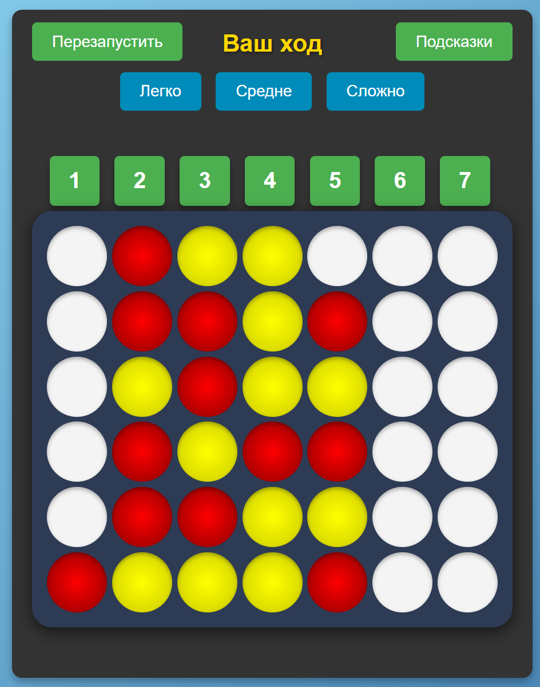
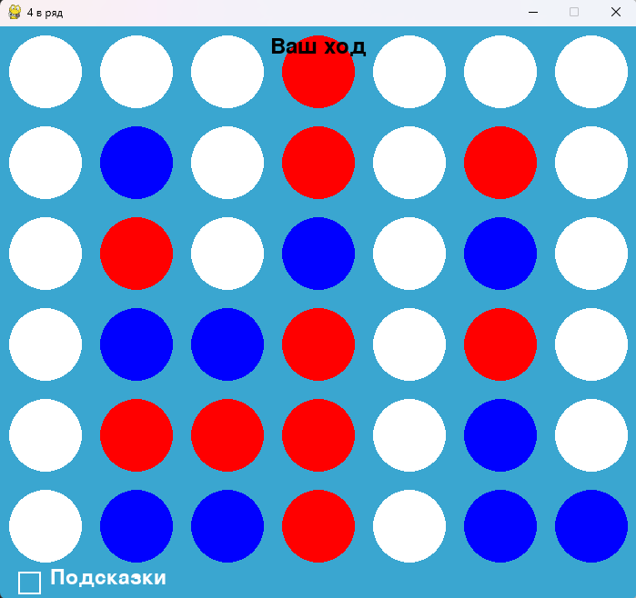

# Connect Four (4 в ряд)

Игра "4 в ряд" реализована с использованием JavaScript, HTML, CSS и Electron для создания настольного приложения, также есть версия на Python. В игре два игрока (человек и ИИ), и цель — заполнить горизонтальный, вертикальный или диагональный ряд из четырех фишек одного цвета.

## Описание

Игра состоит из доски 7x6, где игроки поочередно бросают фишки в один из столбцов. Фишки опускаются вниз, пока не столкнутся с другими фишками. Первый, кто выстроит четыре фишки подряд в одном ряду (горизонтальном, вертикальном или диагональном), выигрывает.

В JS версии игрок может выбрать уровень сложности для ИИ (Легко, Средне, Сложно). Игра продолжается до победы одного из игроков или ничьей.

## Структура проекта
### JS:

- **game4row.js** — основная логика игры, включая работу с доской и алгоритм ИИ (Minimax с альфа-бета отсечением).
- **index.html** — разметка страницы игры.
- **style.css** — стили для игрового поля и интерфейса.
- **script.js** — взаимодействие с пользователем и рендеринг интерфейса.
- **main.js** — настройки для приложения Electron, включая создание окна и меню.
- **preload.js** — скрипт для безопасной работы с Node.js API в браузере.

### Python

- **game.py** — основная логика игры, включая работу с доской и алгоритм ИИ (Minimax с альфа-бета отсечением).
- **game_visualize.py** — визуализация игры с помощью pygame
- **main.py** — запуск игры

## Запуск проекта

1. Клонируйте репозиторий:

   ```bash
   git clone <URL_репозитория>
   ```
2. Перейдите в папку проекта

   ```bash
   cd <project folder>
   ```
3. Установите зависимости:

   Для JS:
   
   ```bash
   npm install
   ```

   Для Python:
   
   ```bash
   pip install pygame
   ```
4. Запустите приложение

   JS:

   ```bash
   npm start
   ```

   Python:
   ```bash
   python main.py
   ```

## Управление игрой

- **Перезапуск игры** — нажмите кнопку "Перезапустить".
- **Выбор уровня сложности ИИ** — выберите сложность (Легко, Средне, Сложно).
- **Подсказки** — включите подсказки для помощи в игре, чтобы увидеть лучший ход для человека.

## Алгоритм ИИ

ИИ использует алгоритм Minimax с альфа-бета отсечением для выбора наилучшего хода. Это позволяет ИИ рассчитывать все возможные ходы, оценивая их по определенным критериям, и выбирать наиболее оптимальный.

## Демонстрация
**JS**:



**Python**:


